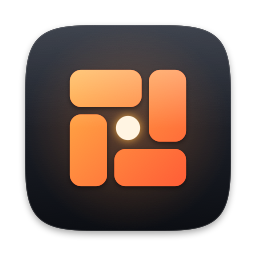

# roto brand

## Name

Always lowercase: **roto**, even at the start of a sentence. Never "Roto" or "ROTO".

## Idea

**Spotlight searches. roto does the rest.**

roto keeps Spotlight for search and replaces the pile of tools people install around it. The brand never attacks Spotlight or the apps it replaces; it argues for one small, native, local tool instead of a stack.

| Use | Line |
| --- | --- |
| Primary tagline | Spotlight searches. roto does the rest. |
| Headline | Stop fixing Spotlight. |
| Sign-off | Keep Spotlight. Replace the fixes. |
| Descriptor | A native, local-only menu bar agent for windows, apps, clipboard, and emoji. |

## Mark

Four tiles turning around a spot. The spot is Spotlight; the tiles are the tools roto runs around it. The tiles also read as window halves and quarters, which is where roto started.

 

- One source of truth: `Sources/RotoCore/Brand/BrandMark.swift`. The app icon, menu bar icon, and website assets are all drawn from it. Regenerate with `make brand`.
- Keep clear space around the mark at least as wide as a tile's short side.
- Don't rotate the mark, recolor single tiles, add outlines, stretch it, or place the color mark on busy photos.
- In the menu bar, the mark is a monochrome template image that macOS tints.

| File | Use |
| --- | --- |
| `brand/AppIcon.icns` | App bundle icon |
| `docs/assets/icon-1024.png`, `icon-512.png`, `icon-256.png`, `icon-128.png` | README, website, press |
| `docs/assets/mark.svg` | Website logo and favicon |
| `docs/assets/favicon-32.png`, `apple-touch-icon.png` | Browser icons |
| `docs/assets/social-preview.png` | GitHub social preview (1280 × 640) |

## Color

| Name | Hex | Use |
| --- | --- | --- |
| Ink | `#0C0E13` | Dark backgrounds, bottom of the icon body |
| Graphite | `#2A2F3A` | Dark surfaces, top of the icon body |
| Amber | `#FFB547` | Accent, gradient start, the spot's glow |
| Vermilion | `#FF5A36` | Gradient end |
| Paper | `#F4F1EA` | Text on ink, light backgrounds |
| Mist | `#A9B0BD` | Secondary text on ink |
| Slate | `#7B8394` | Tertiary text on ink |

The amber-to-vermilion gradient runs top-left to bottom-right. Use it on the mark and on at most one headline accent per page.

## Type

The Mac's own fonts: SF Pro for text, SF Mono for keys and code. The website loads no web fonts, consistent with roto making no network requests.

## Voice

- Plain and short. Say what it does, in the words a person would use.
- Specific over superlative: "4.7 ms per keystroke", not "blazing fast".
- Only publish numbers we measured, and say what machine they came from.
- Name the limits. Saying what roto won't do is part of the pitch.
- Respect the alternatives. roto replaces a stack; it doesn't mock the parts.
- Write keys as symbols: ⌃⌥V, ⌘↩.
